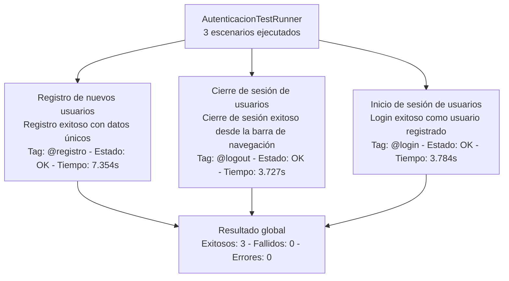

# AUTO_FRONT_SCREENPLAY

## Escenarios de prueba reales probados

Ejecución validada en el runner `AutenticacionTestRunner` con resultado global:
- Total: 3
- Exitosos: 3
- Fallidos: 0
- Errores: 0

| Feature | Escenario ejecutado | Tag principal | Estado | Tiempo |
|---|---|---|---|---|
| Registro de nuevos usuarios | Registro exitoso con datos únicos | `@registro` | OK | 7.354s |
| Cierre de sesión de usuarios | Cierre de sesión exitoso desde la barra de navegación | `@logout` | OK | 3.727s |
| Inicio de sesión de usuarios | Login exitoso como usuario registrado | `@login` | OK | 3.784s |

### Diagrama Mermaid de escenarios reales probados




## Dependencias y frameworks clave

| Componente | Framework / Librería | Propósito |
|---|---|---|
| Build | Gradle | Gestión de dependencias, build y ejecución de tareas |
| Lenguaje | Java | Implementación principal del sistema |
| QA E2E (si aplica) | Serenity BDD + Cucumber + Screenplay | Automatización declarativa por comportamiento |

## Ejecución de pruebas

### 1) Ejecutar toda la suite

En Windows (PowerShell/CMD):

```bash
.\gradlew.bat clean test
```

En bash (Git Bash/WSL):

```bash
./gradlew clean test
```

### 2) Ejecutar solo el runner de autenticación

```bash
./gradlew test --tests com.autofrontscreenplay.runners.AutenticacionTestRunner
```

### 3) Ejecutar por tags de Cucumber

```bash
./gradlew clean test -Dcucumber.filter.tags="@login"
./gradlew clean test -Dcucumber.filter.tags="@registro"
./gradlew clean test -Dcucumber.filter.tags="@logout"
```

### 4) Ubicación de reportes

- Reporte HTML Gradle: `build/reports/tests/test/index.html`
- Resultado XML de la corrida: `build/test-results/test/TEST-com.autofrontscreenplay.runners.AutenticacionTestRunner.xml`

