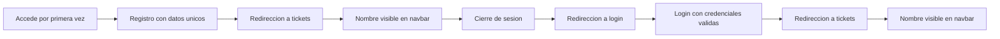

# AUTO_FRONT_SCREENPLAY

## Flujo E2E actual

La suite de autenticacion se ejecuto con un escenario unico, independiente y autosuficiente (end-to-end):

- Total: 1
- Exitosos: 1
- Fallidos: 0
- Errores: 0

| Feature | Escenario ejecutado | Tags | Estado |
|---|---|---|---|
| Flujo completo de autenticacion de usuarios | Flujo end-to-end de autenticacion exitoso | @critico @happy-path @autenticacion | OK |

### Flujo del escenario



## Estructura de automatizacion

- Runner: com.autofrontscreenplay.runners.AutenticacionTestRunner
- Feature principal: src/test/resources/features/autenticacion/01_autenticacion_e2e.feature
- Step definitions consolidadas: src/test/java/com/autofrontscreenplay/stepdefinitions/AutenticacionStepDefinitions.java


## Dependencias y frameworks clave

| Componente | Framework / Librería | Propósito |
|---|---|---|
| Build | Gradle | Gestión de dependencias, build y ejecución de tareas |
| Lenguaje | Java | Implementación principal del sistema |
| QA E2E (si aplica) | Serenity BDD + Cucumber + Screenplay | Automatización declarativa por comportamiento |

## Ejecución de pruebas

### 1) Ejecutar toda la suite

En Windows (PowerShell/CMD):

```bash
.\gradlew.bat clean test
```

En bash (Git Bash/WSL):

```bash
./gradlew clean test
```

### 2) Ejecutar solo el runner de autenticación

```bash
./gradlew test --tests com.autofrontscreenplay.runners.AutenticacionTestRunner
```

### 3) Ejecutar por tags de Cucumber

```bash
./gradlew clean test -Dcucumber.filter.tags="@autenticacion"
./gradlew clean test -Dcucumber.filter.tags="@critico"
./gradlew clean test -Dcucumber.filter.tags="@happy-path"
```

### 4) Ubicación de reportes

- Reporte HTML Gradle: build/reports/tests/test/index.html
- Resultado XML de la corrida: build/test-results/test/TEST-com.autofrontscreenplay.runners.AutenticacionTestRunner.xml
- Reporte Serenity: target/site/serenity/index.html

